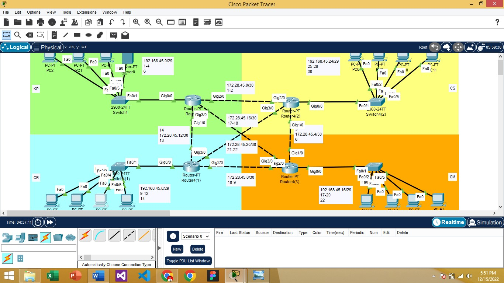

# 🌐 Simulasi Jaringan WAN Perusahaan xyz.net

> Simulation of a multi-branch corporate WAN network using Cisco Packet Tracer. Implements OSPF dynamic routing, DHCP on branch routers, and DNS + Web Server at headquarters (domain: wali.id). Connectivity verified via ping and traceroute across all branches.

---

## 📋 Deskripsi Project

Project ini merupakan simulasi jaringan WAN (Wide Area Network) menggunakan **Cisco Packet Tracer** untuk perusahaan fiktif **xyz.net**. Jaringan terdiri dari satu Kantor Pusat (KP) dan tiga kantor cabang yang saling terhubung menggunakan routing protocol dinamis **OSPF**.

---

## 🏢 Topologi Jaringan



Perusahaan xyz.net memiliki struktur kantor sebagai berikut:

| Branch | Router | Switch | Perangkat |
|--------|--------|--------|-----------|
| Kantor Pusat (KP) | 1 | 1 | 1 Server + 3 PC |
| Cabang Bandung (CB) | 1 | 1 | 4 PC |
| Cabang Makasar (CM) | 1 | 1 | 4 PC |
| Cabang Semarang (CS) | 1 | 1 | 4 PC |

---

## 🔧 Konfigurasi Jaringan

### Alokasi IP Address
- **Block IP Router (antar-router):** `172.28.45.0/24`
- **Block IP PC/Server:** `192.168.45.0/24`
- Alokasi IP dirancang secara **efektif dan efisien** (subnetting)

### Fitur yang Dikonfigurasi
- ✅ **DNS Server & Web Server** di Kantor Pusat dengan domain `wali.id`
- ✅ **DHCP Server** pada router CB, CM, dan CS
- ✅ **Routing Protocol OSPF** (dynamic routing) pada semua router
- ✅ **Load balancing** antar semua branch

---

## 📝 Langkah Konfigurasi

| No | Deskripsi |
|----|-----------|
| 1 | Pembuatan topologi jaringan di Packet Tracer beserta dokumentasi IP Address |
| 2 | Konfigurasi IP, subnet, gateway, dan DNS — Kantor Pusat (KP) |
| 3 | Konfigurasi IP, subnet, gateway, dan DNS — Cabang Bandung (CB) |
| 4 | Konfigurasi IP, subnet, gateway, dan DNS — Cabang Makasar (CM) |
| 5 | Konfigurasi IP, subnet, gateway, dan DNS — Cabang Semarang (CS) |
| 6 | Konfigurasi IP Router — Kantor Pusat (KP) |
| 7 | Konfigurasi IP Router — Cabang Bandung (CB) |
| 8 | Konfigurasi IP Router — Cabang Makasar (CM) |
| 9 | Konfigurasi IP Router — Cabang Semarang (CS) |
| 10 | Konfigurasi OSPF pada semua router (KP, CB, CM, CS) |
| 11 | Verifikasi OSPF dengan perintah `show ip ospf neighbor`, `show ip ospf database`, `show ip route ospf` |
| 12 | Uji konektivitas ping & traceroute ke `wali.id` dari semua cabang |

---

## 🧪 Pengujian

Pengujian dilakukan dengan perintah berikut:

```bash
# Ping ke domain
ping wali.id

# Traceroute dari masing-masing cabang ke Kantor Pusat
tracert wali.id

# Verifikasi OSPF
show ip ospf neighbor
show ip ospf database
show ip route ospf
```

Pengujian mencakup koneksi:
- CB → KP
- CM → KP
- CS → KP
- Antar cabang (CB ↔ CM ↔ CS)

---

## 🛠️ Tools & Teknologi


- **Cisco Packet Tracer** — Simulasi jaringan
- **OSPF** — Dynamic routing protocol
- **DHCP** — Dynamic IP assignment untuk PC di cabang
- **DNS + HTTP** — Web server dengan domain `wali.id`
- **Subnetting** — Alokasi IP efisien dengan CIDR `/24`
